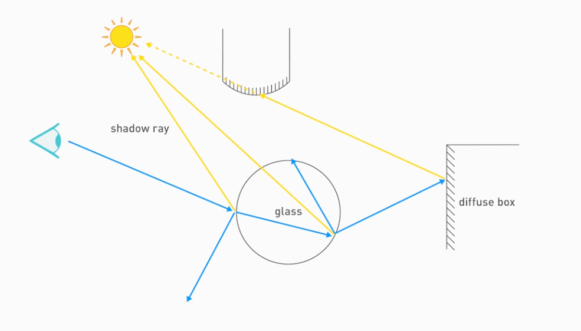

# NOTES

What is Ray Tracing?

*The conventional idea of ray tracing is to draw the actual rays of light that come out of a light source, and follow them as they bounce off of things. If they eventually end up in the eye, then you can calculate al the lightning along the way and use that to draw a good picture of what's going on.*

*With computer graphic ray tracing, you do this backwards. Draw rays out of the camera and try and trace them back to a light source. If you never hit a light source, you get a shadow. If you hit a mirror, you end up with a reflection.*

What is a Ray?

Ray (Origin, Direction)

Ray Casting
- Origin + Distance * Direction

First use of ray tracing was to get shadows.

For each pixel:
- Send ray from eye into the scene
- Send ray from the intersection to each light (shadows)

E.g.,

References:
- https://www.youtube.com/watch?v=gBPNO6ruevk
- https://raytracing.github.io/books/RayTracingInOneWeekend.html#rays,asimplecamera,andbackground
